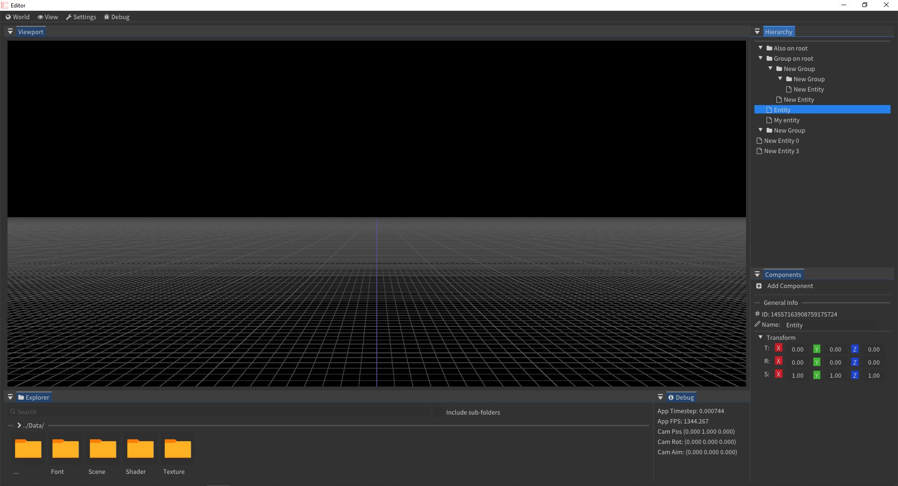

### About
This is the development repo of a 3D Engine/Framework, most of it is written in C++ but some python and lua is used along the way. This project is divided into multiple projects:
* Thirdparty: 
* 1) GLM;
* 2) ImGui;
* Libraries:
* 1) Common: Math, Memory, Filesystem, Logger, Data Structure and utilities;
* 2) Platform: Event System, Window, Input;
* 3) Renderer: Vulkan Renderer, UI Overlay, Widget Layering;
* 4) Engine: Project Initialization, Application Context, Scene System, Entity Component System, Camera System; 
* Applications:
* 1) Editor: Viewport Widget, 2D Grid, Asset Explorer, Scene Hierarchy;

Used tools, API and libraries in no particular order: Vulkan, Shaderc, Volk, VMA, SDL2, ImGui, GLM, EnTT, STB, Premake5;

### Building
For now this is only tested on Windows but I can add support for Linux if requested (the building process is not yet ideal). With that said, on Windows you must have Python with Requests and TQDM installed and then run ```py Build/Setup.py```, any other dependency will be downloaded by the script and a Visual Studio Solution 2022 will be generated. (If you didn't have Vulkan previously installed, restart the terminal session and run the command again, as the environment paths won't be refreshed).

### Progress
I'll try to attach a print or any media on important commits, they'll be in [Documentation](https://github.com/franzpedd/vk_sandbox/tree/main/Documentation) and such will be provided once a game or application has been deployed using this Engine/Framework.
Here is an example of how it's going so far: 